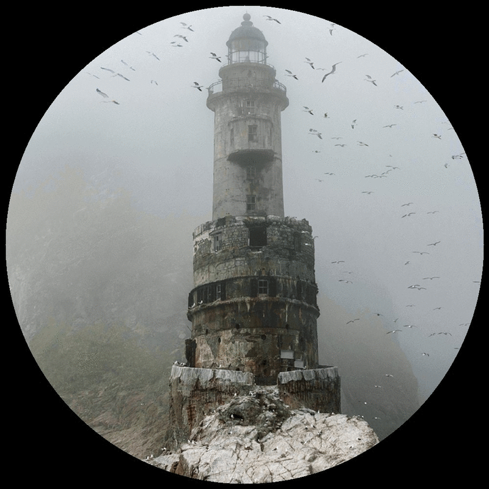

# RotaryLady (Rotary Laser Display)

Simulates brightness-modulated rotating laser beams for screenless image rendering via scattering.

## Description

This software tests how well an image can be rendered using a laser scattering display — a kind of display that doesn’t need a physical screen. Instead, it relies on light scattering off particles like dust in the air.

In the simulation, red, green, and blue lasers are arranged around a circular display area. Each laser rotates in the display plane and its brightness is adjusted repeatedly as it sweeps across the display area. The resulting dynamic laser beams overlap in mid-air, creating scattering patterns that in sum reproduce the source image as closely as possible.

Here's a video on YouTube that visualizes the concept:

  
   
  'Laser Scattering Rendering - a Photorealistic Mid-Air Display (Simulation)' by dropped_box

## Usage Linux (only manually)

-   Make sure the required Python packages are installed: `numpy`, `cython`, `opencv` and `multiprocessing`
-   Run `cython speedup.pyx` to generate the corresponding C file
-   Compile the C code. On the test system, `gcc` was used with the following command:  
`gcc -shared -pthread -fPIC -fwrapv -O2 -Wall -fno-strict-aliasing -I/usr/include/python3.9 -o speedup.so speedup.c`

-	  Adjust the parameters in `param.py` (optional)
-   Run `python3 init.py`. This creates 4 files based on the current parameters. With the default parameters, these files total about 1.7 GB
-   Run `python3 match.py`. This reads the source image, renders the output image and saves the result to disk.

## Parameters

### Display configuration (changing these requires running `init.py` again)
-   RESOLUTION – Number of brightness changes during a half rotation of a laser
-   LASERCOUNT – Number of lasers of one color
-   IMG_WIDTH – Width and height (in pixels) of both the input and rendered image; also determines simulation granularity

### Rendering

-	IMAGE – Filename of the source image to be rendered 
-   THRESHOLD – The improvement per optimization cycle is measured as the reduction in RMSE across all pixels of each color channel. The algorithm stops when the improvement per cycle drops below this value. If set too low, floating-point errors may accumulate.

## What Makes a Picture Suitable

-   **Well-suited**: bright backgrounds, few objects
-   **Less suited**: highly detailed images, bright highlights within dark areas

## Example Image

  

The example image is a cropped and downscaled version of a photograph by Yaroslav Shuraev.  
The original image is titled *"Маяк Анива"* and depicts the Aniva Lighthouse in Sakhalin, Russia.  
It is licensed under the [Creative Commons Attribution-Share Alike 4.0 International License](https://creativecommons.org/licenses/by-sa/4.0/deed.en).  
You can view the original image on [Wikimedia](https://commons.wikimedia.org/wiki/File:%D0%9C%D0%B0%D1%8F%D0%BA_%D0%90%D0%BD%D0%B8%D0%B2%D0%B0.jpg).  
This example image is provided solely for demonstration purposes within the scope of this software project and does not constitute a redistribution of the original work.

